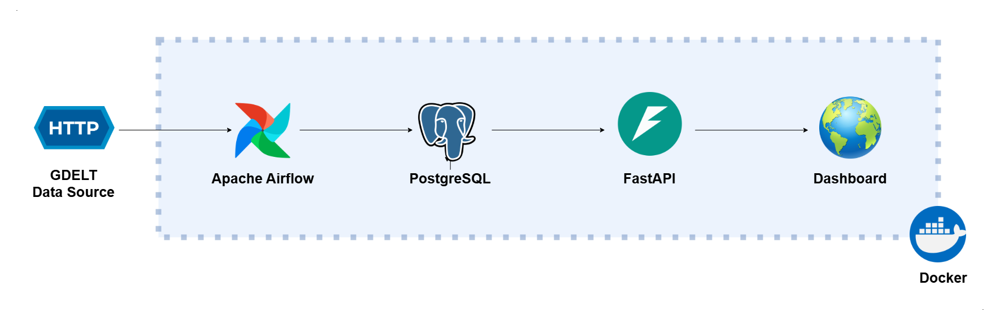
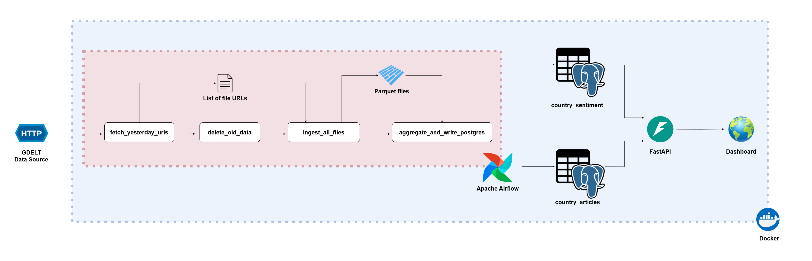

# 🌍 GDELT Sentiment Globe

## 📊 Dashboard

An interactive globe where each country is colored according to its daily sentiment score. Clicking a country opens a sidebar displaying the overall sentiment, per-category sentiment breakdown, and the top source articles contributing to the score.


---

## 💡 Why I Built This

I have built data pipelines for many different scenarios, but this time I wanted to create something I would actually use myself. The idea came from wanting a quick way to understand what was happening around the world without reading hundreds of news articles - an interactive globe where each country is colored by the overall sentiment of its news coverage for the day. Users can glance at the map, identify countries with unusually positive or negative sentiment, and then investigate the events driving those changes.

---

## 🔮 Future Improvements

- Migrate the pipeline from a local Docker environment to a cloud platform so it can run continuously and automatically without relying on a local machine.
- Apply machine learning to classify news articles more accurately.

---

## 🔎 Overview



---

## 📋 Table of Contents

- [Dashboard](#-dashboard)
- [Development Workflow](#-development-workflow)
- [Data Pipeline Architecture](#-data-pipeline-architecture)
- [Data Structure](#-data-structure)
- [Project Structure](#️-project-structure)
- [Setup](#-setup)
- [References](#-references)

---

## 🧪 Development Workflow

Before building the pipeline, the data source and processing logic were validated in Google Colab using two notebooks:

- **`source_data_validation.ipynb`** - Explores the raw GDELT GKG data to understand the schema, field formats, and data quality before committing to a pipeline design.
- **`pipeline_simulation.ipynb`** - Simulates the full end-to-end pipeline in a notebook environment to prototype and verify the parsing, filtering, country assignment, category classification, and aggregation logic.

---

## 🔄 Data Pipeline Architecture



GDELT publishes a new GKG file every 15 minutes, covering news articles from around the world in multiple languages. This produces 96 files per day. Airflow triggers the pipeline daily to process the previous day's data.

**1. fetch_yesterday_urls**

Downloads the GDELT master index and extracts the ~96 GKG file URLs for the target date.

**2. delete_old_data**

Removes Parquet files older than one day to free local storage before new files are written.

**3. ingest_all_files**

Downloads each GKG archive, extracts the CSV data, and parses article metadata including tone, location mentions, and theme codes.

For each article, the pipeline:
- Drops articles containing fewer than 100 words
- Assigns a primary country based on location mentions
- Classifies the article into one of four categories: politics, economy, health, or crime
- Writes the processed results to Parquet files partitioned by year/month/day/hour

**4. aggregate_and_write_postgres**

Reads all Parquet files for the target date and performs country-level aggregation.

The task:
- Discards articles where multiple countries tie for the highest mention count
- Computes a sentiment score for each country
- Drops countries with fewer than 10 articles
- Writes country-level sentiment scores to the `country_sentiment` table in PostgreSQL
- Writes article-level data to the `country_articles` table in PostgreSQL

**5. Dashboard**

FastAPI serves `index.html` to the browser.

- The globe calls `/api/sentiment`, which joins `country_sentiment` with country boundaries and returns the data used to color each country by its sentiment score.
- Clicking a country triggers a call to `/api/articles/{country_code}`, which retrieves the associated articles from `country_articles` and displays them in the sidebar.

---

## 📖 Data Structure

| Layer | File |
|---|---|
| Parquet | [data_parquet.md](docs/data_parquet.md) |
| PostgreSQL | [data_postgres.md](docs/data_postgres.md) |

---

## 🗂️ Project Structure

```
gdelt-sentiment-globe/
├── dags/
│   └── gdelt_gkg_daily.py          # Airflow DAG and all pipeline logic
├── src/gdelt/
│   ├── parsers.py                  # GKG field parsers (tone, locations, themes)
│   ├── countries.geojson           # Country boundary data for the globe
│   └── fips_to_iso.csv             # FIPS-to-ISO3 country code mapping
├── dashboard/
│   ├── main.py                     # FastAPI backend
│   ├── static/index.html           # Globe frontend (globe.gl)
│   ├── Dockerfile
│   └── requirements.txt
├── notebooks/
│   ├── pipeline_simulation.ipynb   # End-to-end pipeline prototype
│   └── source_data_validation.ipynb
├── scripts/
│   ├── download_static_data.py     # One-time setup: downloads GeoJSON and FIPS mapping
│   └── generate_env.py             # Generates .env from template
├── docs/
│   ├── images/                     # Architecture and dashboard screenshots
│   ├── data_parquet.md             # Data dictionary - Parquet intermediate storage
│   ├── data_postgres.md            # Data dictionary - PostgreSQL tables
│   ├── setup.md                    # Setup instructions
│   └── REFERENCES.md
├── docker-compose.yaml
├── requirements.txt
└── requirements-dev.txt

```

---

## 🚀 Setup

See [setup.md](docs/setup.md) for step-by-step instructions to set up the environment and run the pipeline.

---

## 📚 References

See [REFERENCES.md](docs/REFERENCES.md) for all external documentation and resources used in this project.
